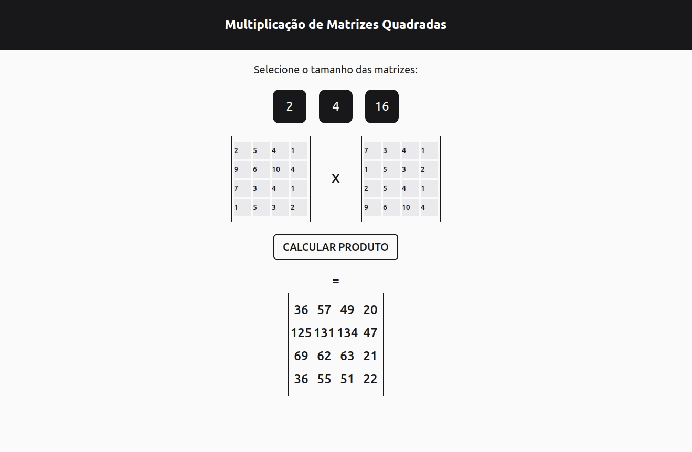

# Multiplicação de Strassen

**Número da Lista**: 18<br>
**Conteúdo da Disciplina**: Divide and Conquer<br>

## Alunos
|Matrícula | Aluno |
| -- | -- |
| 18/0041592  |  Denys Rógeres |
| 19/0109963  |  João Victor Batista |

## Sobre 
O algoritmo de Strassen para multiplicação de matrizes é um método que tem por objetivo otimizar o cálculo do produto de 2 matrizes quadradas. Se trata de um método recursivo que separa uma matriz em 4 sub-matrizes de dimensões n/2 x n/2 a cada iteração. Dessa forma, a complexidade é reduzida de de O(N³) para aproximadamente O(N^2.8).

## Instalação 
**Linguagem**: Javascript<br>
**Framework**: React<br>

### Requisitos 
- *npm* ou *yarn*
- node v16


### Instalação
Para instalar o projeto, bastar seguir os seguintes comandos:
```
$ git clone https://github.com/projeto-de-algoritmos/DC_MultiplicacaoStrassen.git
```

E instalar o projeto com o comando:
```
$ npm install
```

Para inicializar o projeto digite o comando:
```
$ npm run dev
```

ou 

```
$ yarn dev
```

## Screenshots



